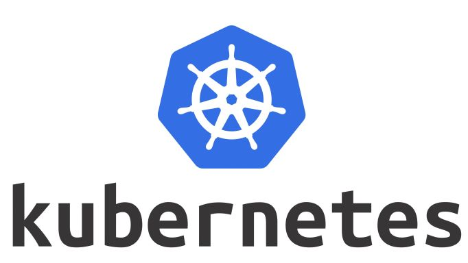

# Kubenertes Cluster Configuration



This is project will help you setup kubernetes out of the box with help of a configuration tool called [Ansible](https://docs.ansible.com/ansible/latest/installation_guide/intro_installation.html). This is an open source contribution by DeveloperPrince


NB: Please take note it is usually recommended to make user of stable release of kubernetes however we shall make use kubernetes 1.22.0 instead of the latest release.

### Step 1 — Setting Up the Workspace Directory and Ansible Inventory File

within the the /cluster/hosts file edit the ip addresses your control_plane ip and worker node ip's.

NB: You can add more worker nodes in the inventory file by adding the worker_node with its corresponding ip addresses.

### Step 2. Creating a Non-Root User on All Remote Servers

```bash
ansible-playbook -i hosts /cluser<dist-name>/initial.yml
```

### Step 3 — Installing Kubernetetes’ Dependencies

In this section, you will install the operating-system-level packages required by Kubernetes with Linux based package manager. These packages are:

Docker - a container runtime. It is the component that runs your containers. Kubernetes supports other runtimes, but Docker is still a popular and straightforward choice.

kubeadm - a CLI tool that will install and configure the various components of a cluster in a standard way.

kubelet - a system service/program that runs on all nodes and handles node-level operations.

kubectl - a CLI tool used for issuing commands to the cluster through its API Server.

Create a file named /cluster/<dist-name>/kube-dependencies.yml in the workspace:

```bash
ansible-playbook -i hosts /cluster/<dist-name>/kube-dependencies.yml
```

### Step 4 — Setting Up the Control Plane Node

In this section it worth appreciating what is an ingress controller vs a loadbalancer. In exploring the differences I will then explain as to why ingress will be a very good choice in setting up our kubernetes CNI. We shall also speak about Healm and how it is a powerful tool to use in handling some kubernetes tooling, in our case we use helm in creating our nginx controller.

#### Kubernetes Ingress Controller Vs LoadBalancer

Kubernetes Ingresses offer you a flexible way of routing traffic from beyond your cluster to internal Kubernetes Services. Ingress Resources are objects in Kubernetes that define rules for routing HTTP and HTTPS traffic to Services. For these to work, an Ingress Controller must be present; its role is to implement the rules by accepting traffic (most likely via a Load Balancer) and routing it to the appropriate Services. Most Ingress Controllers use only one global Load Balancer for all Ingresses, which is more efficient than creating a Load Balancer per every Service you wish to expose.


#### Helm

[Helm](https://helm.sh/docs/intro/install/) is a package manager for managing Kubernetes. Using Helm Charts with your Kubernetes provides configurability and lifecycle management to update, rollback, and delete a Kubernetes application.

### Step 5 — Setting Up the Worker Nodes

```bash
ansible-playbook -i hosts /workers/workers.yml
```

### Step 6 — Verifying the Cluster

A cluster can sometimes fail during setup because a node is down or network connectivity between the control plane and workers is not working correctly. Let's verify the cluster and ensure that the nodes are operating correctly.

You will need to check the current state of the cluster from the control plane node to ensure that the nodes are ready. If you disconnected from the control plane node, you can SSH back into it with the following command:

```bash
ssh ubuntu@control_plane_ip
```

Then execute the following command to get the status of the cluster:

```bash
kubectl get nodes
```

Depending on how many worker nodes or even whether you have a single node you will see the following:

```bash
Output
NAME     STATUS   ROLES                  AGE     VERSION
control1   Ready    control-plane,master   3m21s   v1.22.0
worker1  Ready    <none>                 46s     v1.22.0
worker2  Ready    <none>                 46s     v1.22.0
```

This step you can now perfrom additional step such as now configuring different users with defined roles this step can be done at your own discretion and you can now run you deployment as services.


